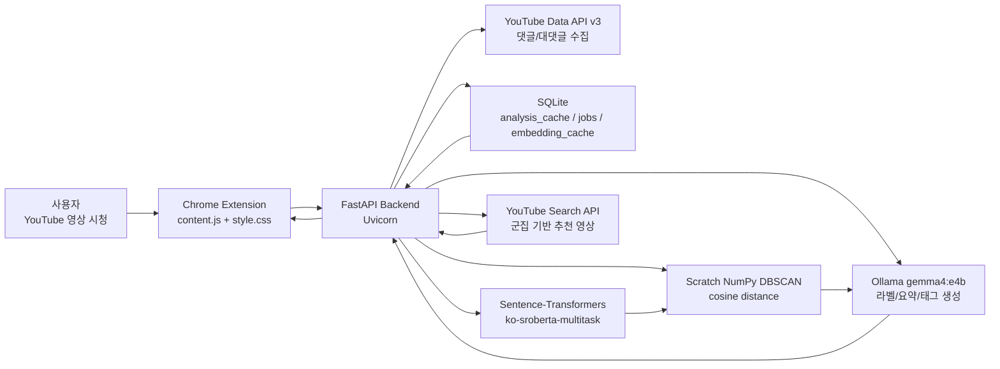
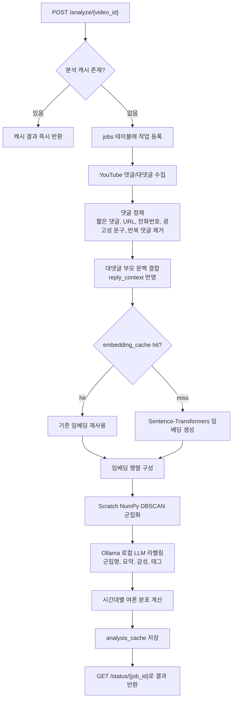
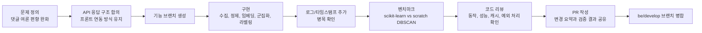

**여론 편향 완화를 위한 댓글 시각화 시스템**

🔗 **Service URL**
- API Docs: `https://osspapi.butterflyjin.kr/docs`
- 실행 형태: YouTube 페이지 위에서 동작하는 Chrome Extension 기반 서비스

📽️ **데모 영상**


## 👥 팀 소개

| <div align="center"><strong>TL/FE/DE 유설희</strong></div>                                           | <div align="center"><strong>PM/BE 박찬홍</strong></div>                                                | <div align="center"><strong>PM/BE 김태윤</strong></div>                                               |
| ------------------------------------------------------------------------------------------------ | --------------------------------------------------------------------------------------------------- | ---------------------------------------------------------------------------------------------------- |

## 🛠️ Tech Stack
### Frontend / Extension

- Runtime: **Chrome Extension Manifest V3**
- UI Injection: **Content Script**
- Language: **Vanilla JavaScript**
- Styling: **CSS**
- HTTP Client: **Fetch API**
- Target Page: **YouTube watch page**

### Backend / ML Pipeline

- Language: **Python**
- Framework: **FastAPI**
- API Server: **Uvicorn**
- YouTube Data: **YouTube Data API v3**
- Embedding: **Sentence-Transformers `jhgan/ko-sroberta-multitask`**
- Clustering: **Scratch NumPy DBSCAN + scikit-learn fallback/benchmark**
- Labeling/Summary: **Ollama `gemma4:e4b`**
- DB/Cache: **SQLite**
- Logging: **Python logging + rotating file handler**
- Deploy/Expose: **systemd + Cloudflare Tunnel**

## 🧩 System Architecture



## 🔎 Analysis Pipeline



## 🧑‍💻 개발 및 코드 리뷰 프로세스

이번 프로젝트는 기능을 한 번에 크게 합치기보다, 프론트엔드와 백엔드가 안정적으로 맞물리도록 작은 단위의 변경을 검토하면서 고도화했습니다.



### 1. 문제 정의

- YouTube 인기순 댓글만 보면 특정 의견이 전체 여론처럼 보일 수 있다는 문제에서 출발했습니다.
- 단순 키워드 집계가 아니라, 댓글의 의미를 기준으로 비슷한 의견을 묶고 군집별 비율을 보여주는 방식으로 접근했습니다.
- 사용자가 현재 영상의 주류 의견과 다른 관점을 함께 볼 수 있도록 추천 영상 기능도 함께 설계했습니다.

### 2. 백엔드 분석 파이프라인 구축

- YouTube Data API v3로 댓글과 대댓글을 수집합니다.
- 짧은 댓글, URL, 전화번호, 광고성 문구, 반복성 댓글, 중복 댓글을 정제합니다.
- 대댓글은 부모 댓글의 문맥을 함께 반영하여 단독 문장만으로 의미가 불분명해지는 문제를 줄였습니다.
- Sentence-Transformers 기반 임베딩을 생성하고, 동일 댓글과 동일 모델 조합은 SQLite `embedding_cache`에 저장하여 재사용합니다.

### 3. DBSCAN 직접 구현 및 검증

- scikit-learn DBSCAN만 사용하는 대신, NumPy 기반 cosine DBSCAN을 직접 구현했습니다.
- 구현 결과를 scikit-learn DBSCAN과 비교하는 벤치마크 스크립트를 추가했습니다.
- 실제 YouTube 댓글 JSON과 임베딩 NPY를 저장해 같은 데이터로 반복 실험할 수 있도록 구성했습니다.
- PCA 차원 축소별 실험도 가능하게 하여, 속도와 군집 품질의 균형을 확인할 수 있게 했습니다.

### 4. 로컬 LLM 기반 라벨링 개선

- 군집 대표 댓글을 Ollama `gemma4:e4b`에 전달해 군집명, 요약, 감성, 태그를 생성합니다.
- 라벨링 실패나 응답 품질 저하에 대비해 fallback 라벨링을 보강했습니다.
- "기타 의견", "분류 안 됨"처럼 추천 검색에 적합하지 않은 라벨은 추천 요청에서 제외하거나 검색어를 보정합니다.

### 5. 추천 영상 검색 개선

- 군집 라벨만 그대로 검색하면 주어가 빠져 엉뚱한 영상이 나오는 문제가 있었습니다.
- 라벨, 요약, 대표 댓글, 태그를 함께 사용하여 검색 후보를 만들고, 후보별 검색 결과가 비어 있으면 다음 후보로 넘어가도록 개선했습니다.
- YouTube 검색 요청과 선택된 검색 후보를 로그로 남겨 추천 품질을 확인할 수 있게 했습니다.

### 6. 운영 안정성 개선

- 분석 시작, 캐시 hit/miss, 댓글 수집, 정제, 임베딩, 군집화, 라벨링, 추천 검색 단계에 로그를 추가했습니다.
- `server.log`가 계속 커지는 문제를 막기 위해 rotating file logging을 적용했습니다.
- 서버 재시작 시 진행 중이던 작업 상태를 정리하고, 캐시된 분석 결과는 즉시 반환되도록 구성했습니다.

### 7. 코드 리뷰 관점

리뷰에서는 단순히 코드가 동작하는지만 보지 않고, 다음 항목을 중심으로 확인했습니다.

- 프론트엔드가 기존 요청/응답 방식으로 계속 동작하는가
- 댓글 수집량이 많아져도 API 응답과 작업 상태 조회가 안정적인가
- 같은 영상 재분석 시 캐시가 정상적으로 사용되는가
- 임베딩과 군집화 시간이 로그로 추적되는가
- DBSCAN 직접 구현 결과가 scikit-learn 결과와 같은 군집을 만드는가
- LLM 라벨링 실패 시 서비스 전체가 실패하지 않는가
- 추천 영상 검색어가 너무 일반적이거나 주어가 빠진 상태로 전달되지 않는가

## 📁 폴더 구조

```txt
OSSP_CSC4004_03_10/
  README.md
  youtube-comment-analyzer/      # Chrome Extension Frontend
  yt-backend/                    # FastAPI 분석 백엔드
    app/
      main.py                    # FastAPI 진입점, CORS, 라우터 등록
      database.py                # SQLite 연결, 테이블 초기화, 캐시 정리
      models.py                  # Pydantic 응답 모델
      pipeline.py                # 댓글 수집, 정제, 임베딩, 군집화, 라벨링 파이프라인
      dbscan_scratch.py          # Scratch NumPy cosine DBSCAN 구현
      logging_config.py          # 콘솔/파일 로그 설정
      routers/
        analyze.py               # POST /analyze/{video_id}
        status.py                # GET /status/{job_id}
        preload.py               # POST /preload
        youtube.py               # GET /youtube/search
    scripts/
      benchmark_dbscan.py        # DBSCAN/PCA 벤치마크
    requirements.txt
```

Frontend 내부 구조:

```txt
youtube-comment-analyzer/
  manifest.json  # Chrome Extension Manifest V3 설정
  content.js     # YouTube 댓글 영역에 분석 버튼/패널 삽입, API 호출, 탭 렌더링
  style.css      # 분석 패널, 차트, 추천 영상, 반응형 스타일
```

## 🔥 Git Commit Convention (커밋 규칙)

효율적인 협업을 위해 다음과 같은 커밋 메세지 규칙을 사용합니다.

**type은 소문자로 통일합니다.**

| 커밋 타입     | 설명                           |
| ------------- | ------------------------------ |
| 🎉 `feat`     | 새로운 기능 추가               |
| 🐛 `fix`      | 버그/오류 수정                 |
| 🛠 `chore`    | 코드/내부 파일/설정 수정       |
| 📝 `docs`     | 문서 수정 (README 등)          |
| 🔄 `refactor` | 코드 리팩토링 (기능 변경 없음) |
| 🧪 `test`     | 테스트 코드 추가/수정          |
| 🎨 `style`    | 스타일 변경(포맷, 세미콜론 등) |

💻 **예시**

```bash
git commit -m "feat: restaurant card 컴포넌트 추가"
git commit -m "fix: 네이버페이 결제수단 오류 수정"
git commit -m "style: 식당리스트 카드디자인 수정"
```

## 📁 폴더 구조

```txt
src/
  api/          # axios 인스턴스/요청 함수
  components/   # UI 컴포넌트 (도메인별 폴더 포함)
  hooks/        # 커스텀 훅
  layouts/      # 레이아웃
  lib/          # 공용 유틸 (cn 등)
  pages/        # 라우트 단위 페이지
  query/        # TanStack Query 설정
  stores/       # 전역 상태관리
  styles/       # 전역 스타일
  types/        # 전역 타입 (UI 모델)
  utils/        # 공용 유틸 함수
```

## 🌿 Branch

- main : 배포/최종 안정 브랜치 **(직접 push 금지)**
- develop: 개발 통합 브랜치 (기본 작업 브랜치)
- 작업 브랜치 네이밍:
  - `feat/mainPage`
  - `fix/myPagePath`
  - `chore/SearchPage`
  - `refactor/Header`

## 🎯 작업 루틴

기본 브랜치는 develop

작업은 항상 `develop`에서 브랜치를 따서 진행하고, PR은 develop으로 올립니다.

### 1. 작업 시작 전 (최신화)

```bash
git checkout develop
git pull --rebase origin develop
```

### 2. 작업 브랜치 생성

```bash
git checkout -b feat/featureName
```

### 3. 작업 후 커밋 & 푸시

```bash
git add .     # 필요하면 git add file명 으로 특정 파일만 추가해도 됨
git commit -m "feat: 자세한 내용 적기"
git push -u origin feat/featureName
```

### 4. PR 생성

- feat/<featureName> → develop 로 PR 생성
- PR 본문에 Closes #이슈번호 작성해서 merge 시 이슈가 자동으로 닫히도록 설정

```md
Closes #이슈번호
```

### 5. 리뷰 & 머지

- 최소 1명 리뷰 후 merge
- main은 배포/최종용 브랜치이기에 **직접 push 금지**

## 🔒 보안

- .env 및 민감정보는 절대 커밋 금지
- 공유가 필요한 환경변수는 .env.example에서 키 형태로만 관리합니다.

## 👥 팀 규칙

- **작업 시작전 develop 최신화: git pull**
- PR은 가능한 작게 쪼개서 올리기
- PR에 작업 요약 + 스크린샷/동작 설명 포함하기
- 충돌 발생 시 브랜치에서 먼저 해결 후 PR 업데이트

## 🧩 UI (shadcn/ui)

- 컴포넌트는 src/components/ui에 생성됩니다.
- className 병합 유틸은 src/lib/utils.ts의 cn()을 사용합니다.

## 💡 시작 방법

### 1. Clone & Install

```bash
git clone https://github.com/OSSP-CSC4004-03-10/OSSP_CSC4004_03_10.git
cd OSSP_10
pnpm i
```

### 2. Environment Values

.env는 커밋하지 않습니다. .env.example을 복사해서 사용합니다.

```bash
# macOS/Linux
cp .env.example .env
```

```bash
:: Windows (cmd)
copy .env.example .env
```

### 3. Run

```bash
pnpm dev
```

### 4. Build/Preview

```bash
pnpm build
pnpm preview
```
